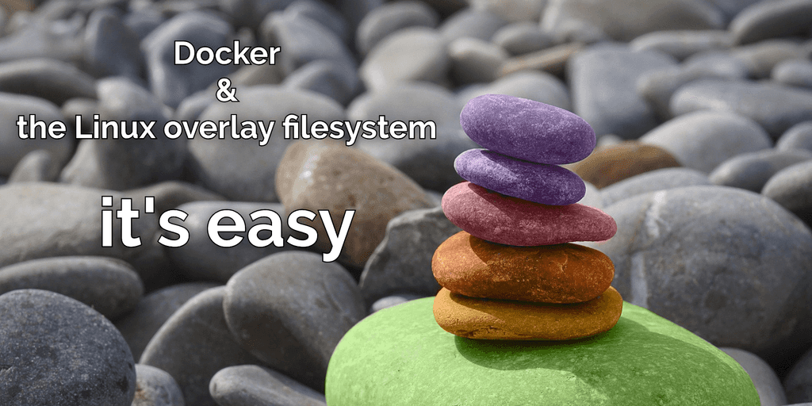
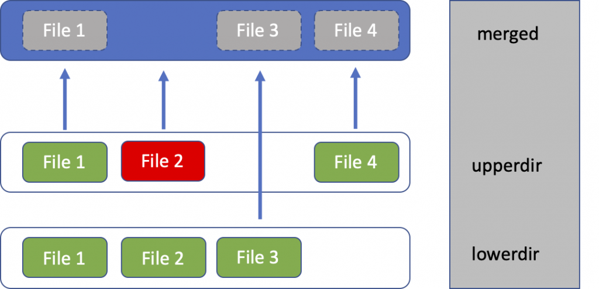

## Docker image internal technologies


### Create following structure


## Install overlay filesystem
```bash
# Ubuntu
sudo apt-get install overlayroot
# redhat
sudo yum install fuse-overlayfs
```

### Creating the loop Device

1. Make lower directory
    ```bash
    mkdir /tmp/lower
    dd if=/dev/zero of=lower.img bs=1k count=1024
    mkfs.ext4 -i 1024 -b 1024 -m 5 -F -v lower.img

    mount lower.img /tmp/lower -t ext4 -o loop

    ```
2. Make upper directory
    ```bash
    mkdir /tmp/upper
    dd if=/dev/zero of=upper.img bs=1k count=1024
    mkfs.ext4 -i 1024 -b 1024 -m 5 -F -v upper.img

    mount upper.img /tmp/upper -t ext4 -o loop
    ```
3. Create `file1, file2, and file3` on lower directory
    ```bash
    cd /tmp/lower
    touch {file1,file2,file3}
4. Create `file1,file2, and file4` on upper directory
    ```bash
    cd /tmp/upper
    touch {file1,file2,file4}
    ```
5. Now unmount filesystem and mount in readonly mode
    ```bash
    umount /tmp/lower
    umount /tmp/upper
    mount upper.img /tmp/upper -t ext4 -o loop -o ro
    mount lower.img /tmp/lower -t ext4 -o loop -o ro
    ```
6. Create workdir, and merged dir
    ```bash
    mkdir  /tmp/workdir /mnt/merged 
    sudo mount -t overlay overlay -olowerdir=/tmp/lower,upperdir=/tmp/upper,workdir=/tmp/workdir /mnt/merged
    ```

## References
1. [Creating ram disk](https://tldp.org/HOWTO/archived/Loopback-Root-FS/Loopback-Root-FS-3.html)
2. [Desacralizing the Linux overlay filesystem in Docker](https://www.adaltas.com/en/2021/06/03/linux-overlay-filesystem-docker/)
3. [Understanding Container Images, Part 3: Working with Overlays](https://blogs.cisco.com/developer/373-containerimages-03)
