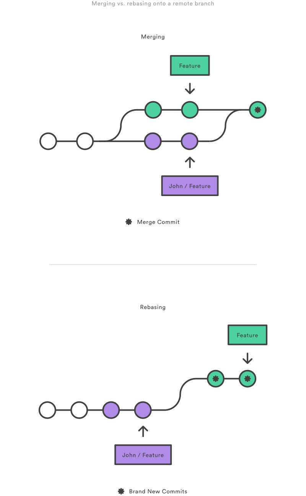
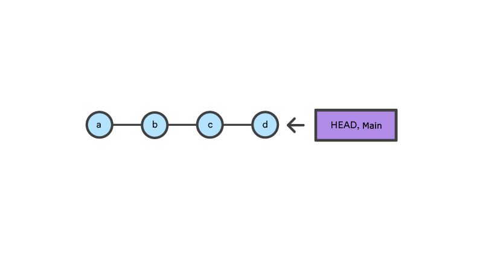

## Advanced Git

## Merging vs. rebasing
 Both of these commands are designed to integrate changes from one branch into another branch—they just do it in very different ways.

 * A forked commit history
 

 To incorporate the new commits into your feature branch, you have two options: **merging** or **rebasing**.

#### The merge option

```bash
git checkout feature
git merge main
```
In one line
```bash
git merge feature main
```

Merging is nice because it’s a non-destructive operation. The existing branches are not changed in any way. This avoids all of the potential pitfalls of rebasing

#### The rebase option
```bash
git checkout feature
git rebase main
```
This moves the entire feature branch to begin on the tip of the `main` branch, effectively incorporating all of the new commits in `main`. But, instead of using a merge commit, rebasing _re-writes_ the project history by creating brand new commits for each commit in the original branch.


Benefits
1. Eliminates the unnecessary merge commits required by `git merge`
2. Linear project history - you can follow the tip of `feature` all the way to the beginning of the project without any forks  


[The golden rule of rebasing](#the-golden-rule-of-rebasing)


#### Interactive rebasing
```bash
git checkout feature
git rebase -i main
```
```bash
pick 33d5b7a Message for commit #1
pick 9480b3d Message for commit #2
pick 5c67e61 Message for commit #3
```
For example, if the 2nd commit fixes a small problem in the 1st commit, you can condense them into a single commit with the `fixup` command:

```bash
pick 33d5b7a Message for commit #1
fixup 9480b3d Message for commit #2
pick 5c67e61 Message for commit #3
```


### The golden rule of rebasing
The golden rule of git rebase is to never use it on _public_ branches.

For example, think about what would happen if you rebased `main` onto your feature branch:


#### Local cleanup (Squashing commits)
```bash
git checkout feature git rebase -i HEAD~3
```


#### Feature Branch Collaboration





## Resetting, checking out & reverting

A checkout is an operation that moves the `HEAD` ref pointer to a specified commit. 


The `HEAD` ref and `main` branch ref currently point to commit d. Now let us execute `git checkout b`


Checkout and reset are generally used for making local or private '**undos**'. 

Revert is considered a safe operation for '**public undos**' as it creates new history which can be shared remotely and doesn't overwrite history remote team members may be dependent on.


## Commit level operations
### Reset a specific commit
```bash
git checkout hotfix git reset HEAD~2
```


### Checkout old commits
```bash
git checkout hotfix
```


### Undo public commits with revert

Reverting undoes a commit by creating a new commit. This is a safe way to undo changes, as it has no chance of re-writing the commit history. 

```bash
git checkout hotfix git revert HEAD~2
```


### File-level operations
#### Git reset a specific file
```bash
git reset HEAD~2 foo.py
```


#### Git checkout file


```bash
git checkout HEAD~2 foo.py
```

## Advanced Git log
### Formatting log output
#### Oneline
```bash
git log --oneline
```
#### Decorating
```bash
git log --oneline --decorate
```

#### Diffs
```bash
git log --stat
git log -p
```

#### The shortlog
```bash
git shortlog
```
#### Graphs
```bash
git log --graph --oneline --decorate
```
#### Custom formatting
```bash
git log --pretty=format:"%cn committed %h on %cd"
```
### Filtering the commit history
#### By amount
```bash
git log -3
```
#### By date
```bash
git log --after="2022-7-1"
git log --after="yesterday"
git log --after="1 week ago"
git log --after="2022-7-1" --before="2022-7-4"
```

#### By author
```bash
git log --author="John"
```
#### By message
```bash
git log --grep="JRA-224:"
```
#### By file
For example, the following returns all commits that affected either the `foo.py `or the `bar.py `file
```bash
git log -- foo.py bar.py
```
#### By range
To show the differences between 2 branches
```bash
git log main..feature
```

#### Filtering merge commits
```bash
git log --no-merges
```
To show only  merge commits
```bash
git log --merges
```

### Git hooks
Git hooks are scripts that run automatically every time a particular event occurs in a Git repository.
#### Installing hooks
Hooks reside in the .git/hooks directory of every Git repository.
As an example, try installing a simple `prepare-commit-msg` hook. Remove the `.sample` extension from this script, and add the following to the file:
```bash
#!/bin/sh

echo "# Please include a useful commit message!" > $1
```
```bash
chmod +x prepare-commit-msg
```

## Git refs: An overview


### Hashes
The most direct way to reference a commit is via its SHA-1 hash.
This acts as the unique ID for each commit.
```bash
git log
```
It’s sometimes necessary to resolve a branch, tag, or another indirect reference into the corresponding commit hash

The following returns the hash of the commit pointed to by the main branch
```bash
git rev-parse main
```

### Refs
A **ref** is an indirect way of referring to a commit. This is Git’s internal mechanism of representing branches and tags.
Refs are stored as normal text files in the `.git/refs` directory

```bash
.git/refs/ heads/ main some-feature remotes/ origin/ main tags/ v0.9
```
```bash
# Output the contents of `refs/heads/main` file: cat .git/refs/heads/main # Inspect the commit at the tip of the `main` branch: git log -1 main
```

#### Specifying refs
When passing a ref to a Git command, you can either define the full name of the ref, or use a short name and let Git search for a matching ref.

```bash
git show some-feature
```
or
```bash
git show refs/heads/some-feature
```


#### Special refs

In addition to the `refs` directory, there are a few special refs that reside in the top-level `.git` directory. They are listed below:

* **HEAD** – The currently checked-out commit/branch.
* **FETCH_HEAD** – The most recently fetched branch from a remote repo.
* **ORIG_HEAD** – A backup reference to HEAD before drastic changes to it.
* **MERGE_HEAD** – The commit(s) that you’re merging into the current branch with git merge.
* **CHERRY_PICK_HEAD** – The commit that you’re cherry-picking.

These refs are all created and updated by Git when necessary. For example, The `git pull` command first runs `git fetch`, which updates the `FETCH_HEAD` reference. Then, it runs `git merge FETCH_HEAD` to finish pulling the fetched branches into the repository.

## Git stash
`git stash` temporarily shelves (or _stashes_) changes you've made to your working copy so you can work on something else, and then come back and re-apply them later on

### Stashing your work
```bash
git stash
```
### Re-applying your stashed changes
```bash
git stash pop
```
_Popping_ your stash removes the changes from your stash and reapplies them to your working copy.

Alternatively, you can reapply the changes to your working copy and keep them in your stash with `git stash apply`:

### Stashing untracked or ignored files
By default, running `git stash` will stash:

* changes that have been added to your index (staged changes)
* changes made to files that are currently tracked by Git (unstaged changes)

But it will **not** stash:

* new files in your working copy that have not yet been staged
* files that have been ignored

Adding the `-u` option (or `--include-untracked`) tells `git stash` to also stash your untracked files:

```bash
git stash -u
```

### Managing multiple stashes
```bash
git stash list
stash@{0}: WIP on main: 5002d47 our new homepage
stash@{1}: WIP on main: 5002d47 our new homepage
stash@{2}: WIP on main: 5002d47 our new homepage

```
To provide a bit more context, it's good practice to annotate your stashes with a description, using `git stash save "message"`

```bash
git stash save "add style to our site"
```
```bash
git stash list
stash@{0}: On main: add style to our site
stash@{1}: WIP on main: 5002d47 our new homepage
stash@{2}: WIP on main: 5002d47 our new homepage

```

By default, `git stash pop` will re-apply the most recently created stash: `stash@{0}`

```bash
git stash pop stash@{2}
```
### Viewing stash diffs
```bash
git stash show
```
```bash
git stash show -p
```

### Creating a branch from your stash
```bash
git stash branch add-stylesheet stash@{1}
```
### Cleaning up your stash
```bash
git stash drop stash@{1}
```

## Git cherry pick
`git cherry-pick` is a powerful command that enables arbitrary Git commits to be picked by reference and appended to the current working HEAD.
### When to use git cherry pick

### How to use git cherry pick
To demonstrate how to use git cherry-pick let us assume we have a repository with the following branch state:
```bash
 a - b - c - d   Main
         \
           e - f - g Feature
```

`git cherry-pick `usage is straight forward and can be executed like:
```bash
git cherry-pick commitSha
```
```bash
git checkout main
```
```bash
git cherry-pick f
```
Once executed our Git history will look like:
```bash
 a - b - c - d - f   Main
         \
           e - f - g Feature
```

### Git diff
#### Highlighting changes
```bash
git diff --color-words
```
#### Comparing files: git diff file

```bash
git diff HEAD ./path/to/file
```
#### Comparing all changes
By default `git diff` will show you any uncommitted changes since the last commit.
```bash
git diff
```
#### Comparing files between two different commits
```bash
git diff 957fbc92b123030c389bf8b4b874522bdf2db72c ce489262a1ee34340440e55a0b99ea6918e19e7a
```
#### Comparing two branches
```bash
git diff branch1..other-feature-branch
```

### References
1. [Getting Git right](https://www.atlassian.com/git)