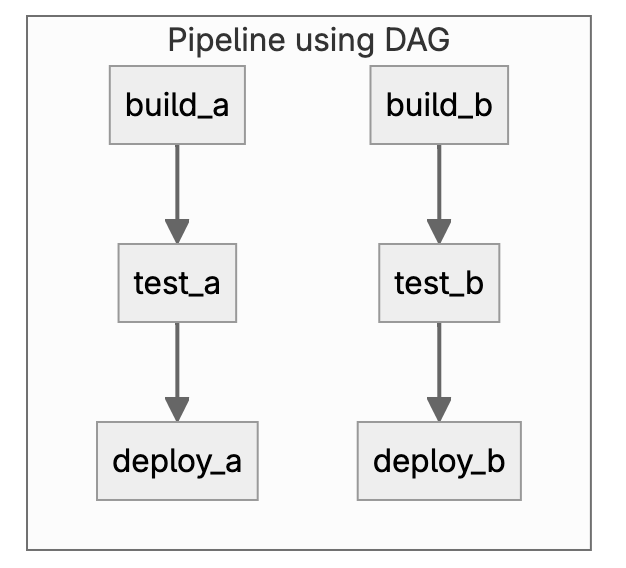
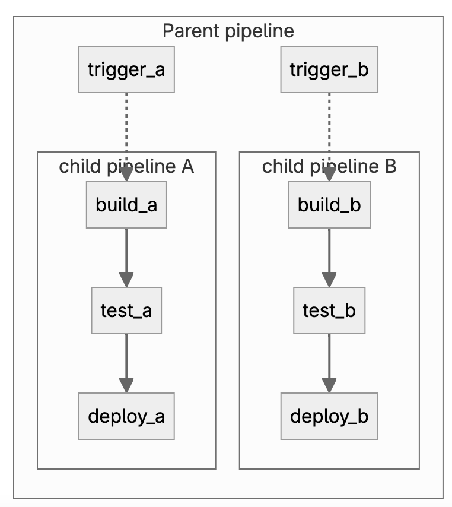

# GitLab Pipeline
## Basic pipelines


```yaml
stages:
  - build
  - test
  - deploy

default:
  image: alpine

build_a:
  stage: build
  script:
    - echo "This job builds something."

build_b:
  stage: build
  script:
    - echo "This job builds something else."

test_a:
  stage: test
  script:
    - echo "This job tests something. It will only run when all jobs in the"
    - echo "build stage are complete."

test_b:
  stage: test
  script:
    - echo "This job tests something else. It will only run when all jobs in the"
    - echo "build stage are complete too. It will start at about the same time as test_a."

deploy_a:
  stage: deploy
  script:
    - echo "This job deploys something. It will only run when all jobs in the"
    - echo "test stage complete."

deploy_b:
  stage: deploy
  script:
    - echo "This job deploys something else. It will only run when all jobs in the"
    - echo "test stage complete. It will start at about the same time as deploy_a."

```

## Dependency relationships between your jobs.

```yaml
stages:
  - build
  - test
  - deploy

default:
  image: alpine

build_a:
  stage: build
  script:
    - echo "This job builds something quickly."

build_b:
  stage: build
  script:
    - echo "This job builds something else slowly."

test_a:
  stage: test
  needs: [build_a]
  script:
    - echo "This test job will start as soon as build_a finishes."
    - echo "It will not wait for build_b, or other jobs in the build stage, to finish."

test_b:
  stage: test
  needs: [build_b]
  script:
    - echo "This test job will start as soon as build_b finishes."
    - echo "It will not wait for other jobs in the build stage to finish."

deploy_a:
  stage: deploy
  needs: [test_a]
  script:
    - echo "Since build_a and test_a run quickly, this deploy job can run much earlier."
    - echo "It does not need to wait for build_b or test_b."

deploy_b:
  stage: deploy
  needs: [test_b]
  script:
    - echo "Since build_b and test_b run slowly, this deploy job will run much later."

```
## Parent-child pipelines

```yaml
stages:
  - triggers

trigger_a:
  stage: triggers
  trigger:
    include: a/.gitlab-ci.yml
  rules:
    - changes:
        - a/*

trigger_b:
  stage: triggers
  trigger:
    include: b/.gitlab-ci.yml
  rules:
    - changes:
        - b/*
```
`/a/.gitlab-ci.yml`
```yaml
stages:
  - build
  - test
  - deploy

default:
  image: alpine

build_a:
  stage: build
  script:
    - echo "This job builds something."

test_a:
  stage: test
  needs: [build_a]
  script:
    - echo "This job tests something."

deploy_a:
  stage: deploy
  needs: [test_a]
  script:
    - echo "This job deploys something."
```
`/b/.gitlab-ci.yml`
```yaml
stages:
  - build
  - test
  - deploy

default:
  image: alpine

build_b:
  stage: build
  script:
    - echo "This job builds something else."

test_b:
  stage: test
  needs: [build_b]
  script:
    - echo "This job tests something else."

deploy_b:
  stage: deploy
  needs: [test_b]
  script:
    - echo "This job deploys something else."
```


## Types of pipelines

Four types of pipelines exist:

* Branch pipelines
* Merge request pipelines
```yml
job1:
  script:
    - echo "This job runs in merge request pipelines"
  rules:
    - if: $CI_PIPELINE_SOURCE == 'merge_request_event'
```
You can also use the `workflow: rules` keyword to configure the entire pipeline to run in merge request pipelines. For example:

```yaml
workflow:
  rules:
    - if: $CI_PIPELINE_SOURCE == 'merge_request_event'

job1:
  script:
    - echo "This job runs in merge request pipelines"

job2:
  script:
    - echo "This job also runs in merge request pipelines"
```

A common `workflow` configuration is to have pipelines run for merge requests, tags, and the default branch. For example:

```yaml
workflow:
  rules:
    - if: $CI_PIPELINE_SOURCE == 'merge_request_event'
    - if: $CI_COMMIT_TAG
    - if: $CI_COMMIT_BRANCH == $CI_DEFAULT_BRANCH
```
* Merge result pipelines
* Merge trains

## Job
Jobs are fundamental elements of a GitLab CI/CD pipeline. 

### Control how jobs run
```yaml
stages:
  - test
  - build
  - deploy

variables:
  DEPLOY_TEST: "test"
  DEPLOY_UAT: "uat"
  DEPLOY_STAGING: "staging"
  DEPLOY_PROD: "prod"

test:
  stage: test
  script:
    - echo "Running tests..."

build:
  stage: build
  script:
    - echo "Building project..."

deploy_test:
  stage: deploy
  script:
    - echo "Deploying to test environment..."
    - # Add your deployment commands here
  environment:
    name: $DEPLOY_TEST
  rules:
    - if: $CI_COMMIT_BRANCH == "development"


deploy_staging:
  stage: deploy
  script:
    - echo "Deploying to staging environment..."
  environment:
    name: $DEPLOY_STAGING
  rules:
    - if: $CI_COMMIT_BRANCH == "staging"

deploy_prod:
  stage: deploy
  script:
    - echo "Deploying to production environment..."
  environment:
    name: $DEPLOY_PROD
  when: manual
  rules:
    - if: $CI_COMMIT_BRANCH == $CI_DEFAULT_BRANCH
```


## Specify when jobs run with `rules`
Use `rules` to include or exclude jobs in pipelines.  
Rules are evaluated in order until the first match. 
### Example 1
```yaml
job:
  script: echo "Hello, Rules!"
  rules:
    - if: $CI_PIPELINE_SOURCE == "merge_request_event"
      when: manual
      allow_failure: true
    - if: $CI_PIPELINE_SOURCE == "schedule"
```
### Example 2

```yaml
job:
  script: echo "Hello, Rules!"
  rules:
    - if: $CI_PIPELINE_SOURCE == "merge_request_event"
      when: never
    - if: $CI_PIPELINE_SOURCE == "schedule"
      when: never
    - when: on_success
```
[`when`](https://docs.gitlab.com/ee/ci/yaml/#when)  
[CI_PIPELINE_SOURCE](https://docs.gitlab.com/ee/ci/jobs/job_rules.html#ci_pipeline_source-predefined-variable)

### Complex rules
```yaml
docker build:
  script: docker build -t my-image:$CI_COMMIT_REF_SLUG .
  rules:
    - if: $VAR == "string value"
      changes:  # Include the job and set to when:manual if any of the follow paths match a modified file.
        - Dockerfile
        - docker/scripts/**/*
      when: manual
      allow_failure: true
```

## Reuse rules in different jobs
Use `!reference` tags to reuse rules in different jobs. 
```yaml
.default_rules:
  rules:
    - if: $CI_PIPELINE_SOURCE == "schedule"
      when: never
    - if: $CI_COMMIT_BRANCH == $CI_DEFAULT_BRANCH

job1:
  rules:
    - !reference [.default_rules, rules]
  script:
    - echo "This job runs for the default branch, but not schedules."

job2:
  rules:
    - !reference [.default_rules, rules]
    - if: $CI_PIPELINE_SOURCE == "merge_request_event"
  script:
    - echo "This job runs for the default branch, but not schedules."
    - echo "It also runs for merge requests."
```

## [`workflow:rules`](https://docs.gitlab.com/ee/ci/yaml/index.html#workflowrules)

The `rules` keyword in `workflow` is similar to rules defined in jobs, but controls whether or not a whole pipeline is created.

Example of `workflow:rules`:
```yaml
workflow:
  rules:
    - if: $CI_COMMIT_TITLE =~ /-draft$/
      when: never
    - if: $CI_PIPELINE_SOURCE == "merge_request_event"
    - if: $CI_COMMIT_BRANCH == $CI_DEFAULT_BRANCH

```
### Example of `workflow:rules:variables`:
```yaml
variables:
  DEPLOY_VARIABLE: "default-deploy"

workflow:
  rules:
    - if: $CI_COMMIT_REF_NAME == $CI_DEFAULT_BRANCH
      variables:
        DEPLOY_VARIABLE: "deploy-production"  # Override globally-defined DEPLOY_VARIABLE
    - if: $CI_COMMIT_REF_NAME =~ /feature/
      variables:
        IS_A_FEATURE: "true"                  # Define a new variable.
    - when: always                            # Run the pipeline in other cases

job1:
  variables:
    DEPLOY_VARIABLE: "job1-default-deploy"
  rules:
    - if: $CI_COMMIT_REF_NAME == $CI_DEFAULT_BRANCH
      variables:                                   # Override DEPLOY_VARIABLE defined
        DEPLOY_VARIABLE: "job1-deploy-production"  # at the job level.
    - when: on_success                             # Run the job in other cases
  script:
    - echo "Run script with $DEPLOY_VARIABLE as an argument"
    - echo "Run another script if $IS_A_FEATURE exists"

job2:
  script:
    - echo "Run script with $DEPLOY_VARIABLE as an argument"
    - echo "Run another script if $IS_A_FEATURE exists"

```

## [Job keywords](https://docs.gitlab.com/ee/ci/yaml/index.html#job-keywords)
1. `after_script`
### Example of `after_script`:
```yaml
job:
  script:
    - echo "An example script section."
  after_script:
    - echo "Execute this command after the `script` section completes."
```
2. `artifacts`
Use artifacts to specify which files to save as [`job artifacts`](https://docs.gitlab.com/ee/ci/jobs/job_artifacts.html).

```yaml
stages:
  - test
  - build
  - deploy

# Test stage
test:
  stage: test
  script:
    - echo "Running tests..."
    - mkdir -p test-results
    - echo "Test result data" > test-results/test-results.txt
  artifacts:
    paths:
      - test-results/

# Build stage
build:
  stage: build
  script:
    - echo "Building project..."
    - mkdir -p build
    - echo "Build output data" > build/build-output.txt
  artifacts:
    paths:
      - build/
    dependencies:
      - test

# Deploy to Test
deploy_test:
  stage: deploy
  script:
    - echo "Deploying to test environment..."
    - cat build/build-output.txt
  dependencies:
    - build

# Deploy to UAT
deploy_uat:
  stage: deploy
  script:
    - echo "Deploying to UAT environment..."
    - cat build/build-output.txt
  dependencies:
    - build

# Deploy to Staging (for both development and staging branches)
deploy_staging:
  stage: deploy
  script:
    - echo "Deploying to staging environment..."
    - cat build/build-output.txt
  dependencies:
    - build
  only:
    - development
    - staging

# Deploy to Production (manual and only from main branch)
deploy_prod:
  stage: deploy
  script:
    - echo "Deploying to production environment..."
    - cat build/build-output.txt
  dependencies:
    - build
  only:
    - main
  when: manual
```
## Environments and deployments

```yaml
deploy_staging:
  stage: deploy
  script:
    - echo "Deploy to staging server"
  environment:
    name: staging
    url: https://staging.example.com

```
### Deployment tier of environments

| Environment tier | Environment name examples   |
|------------------|-----------------------------|
| production       | Production, Live            |
| staging          | Staging, Model, Demo        |
| testing          | Test, QC                    |
| development      | Dev, Review apps, Trunk     |
| other            |                             |


### [How GitLab Permissions and Protected Branches Keep Your Code Safe](https://about.gitlab.com/blog/2014/11/26/keeping-your-code-protected/)


* **Guest** - No access to code
* **Reporter** - Read the repository
* **Developer** - Read/Write to the repository
* **Maintainer** - Read/Write to the repository + partial administrative * capabilities
* **Owner** - Read/Write to the repository + full administrative capabilities
### [Protected branches](https://docs.gitlab.com/ee/user/project/protected_branches.html#who-can-modify-a-protected-branch)
