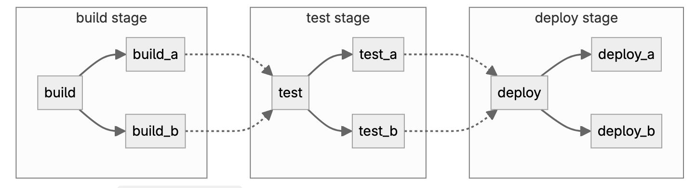

# GitLab Pipeline
## Basic pipelines


```yaml
stages:
  - build
  - test
  - deploy

default:
  image: alpine

build_a:
  stage: build
  script:
    - echo "This job builds something."

build_b:
  stage: build
  script:
    - echo "This job builds something else."

test_a:
  stage: test
  script:
    - echo "This job tests something. It will only run when all jobs in the"
    - echo "build stage are complete."

test_b:
  stage: test
  script:
    - echo "This job tests something else. It will only run when all jobs in the"
    - echo "build stage are complete too. It will start at about the same time as test_a."

deploy_a:
  stage: deploy
  script:
    - echo "This job deploys something. It will only run when all jobs in the"
    - echo "test stage complete."

deploy_b:
  stage: deploy
  script:
    - echo "This job deploys something else. It will only run when all jobs in the"
    - echo "test stage complete. It will start at about the same time as deploy_a."

```

## Dependency relationships between your jobs.

```yaml
stages:
  - build
  - test
  - deploy

default:
  image: alpine

build_a:
  stage: build
  script:
    - echo "This job builds something quickly."

build_b:
  stage: build
  script:
    - echo "This job builds something else slowly."

test_a:
  stage: test
  needs: [build_a]
  script:
    - echo "This test job will start as soon as build_a finishes."
    - echo "It will not wait for build_b, or other jobs in the build stage, to finish."

test_b:
  stage: test
  needs: [build_b]
  script:
    - echo "This test job will start as soon as build_b finishes."
    - echo "It will not wait for other jobs in the build stage to finish."

deploy_a:
  stage: deploy
  needs: [test_a]
  script:
    - echo "Since build_a and test_a run quickly, this deploy job can run much earlier."
    - echo "It does not need to wait for build_b or test_b."

deploy_b:
  stage: deploy
  needs: [test_b]
  script:
    - echo "Since build_b and test_b run slowly, this deploy job will run much later."

```
## Parent-child pipelines

```yaml
stages:
  - triggers

trigger_a:
  stage: triggers
  trigger:
    include: a/.gitlab-ci.yml
  rules:
    - changes:
        - a/*

trigger_b:
  stage: triggers
  trigger:
    include: b/.gitlab-ci.yml
  rules:
    - changes:
        - b/*
```
`/a/.gitlab-ci.yml`
```yaml
stages:
  - build
  - test
  - deploy

default:
  image: alpine

build_a:
  stage: build
  script:
    - echo "This job builds something."

test_a:
  stage: test
  needs: [build_a]
  script:
    - echo "This job tests something."

deploy_a:
  stage: deploy
  needs: [test_a]
  script:
    - echo "This job deploys something."
```
`/b/.gitlab-ci.yml`
```yaml
stages:
  - build
  - test
  - deploy

default:
  image: alpine

build_b:
  stage: build
  script:
    - echo "This job builds something else."

test_b:
  stage: test
  needs: [build_b]
  script:
    - echo "This job tests something else."

deploy_b:
  stage: deploy
  needs: [test_b]
  script:
    - echo "This job deploys something else."
```

## Job
Jobs are fundamental elements of a GitLab CI/CD pipeline. 

### Control how jobs run
```yaml
stages:
  - test
  - build
  - deploy

variables:
  DEPLOY_TEST: "test"
  DEPLOY_UAT: "uat"
  DEPLOY_STAGING: "staging"
  DEPLOY_PROD: "prod"

test:
  stage: test
  script:
    - echo "Running tests..."

build:
  stage: build
  script:
    - echo "Building project..."

deploy_test:
  stage: deploy
  script:
    - echo "Deploying to test environment..."
    - # Add your deployment commands here
  environment:
    name: $DEPLOY_TEST
  rules:
    - if: $CI_COMMIT_BRANCH == "development"


deploy_staging:
  stage: deploy
  script:
    - echo "Deploying to staging environment..."
  environment:
    name: $DEPLOY_STAGING
  rules:
    - if: $CI_COMMIT_BRANCH == "staging"

deploy_prod:
  stage: deploy
  script:
    - echo "Deploying to production environment..."
  environment:
    name: $DEPLOY_PROD
  when: manual
  rules:
    - if: $CI_COMMIT_BRANCH == $CI_DEFAULT_BRANCH
```