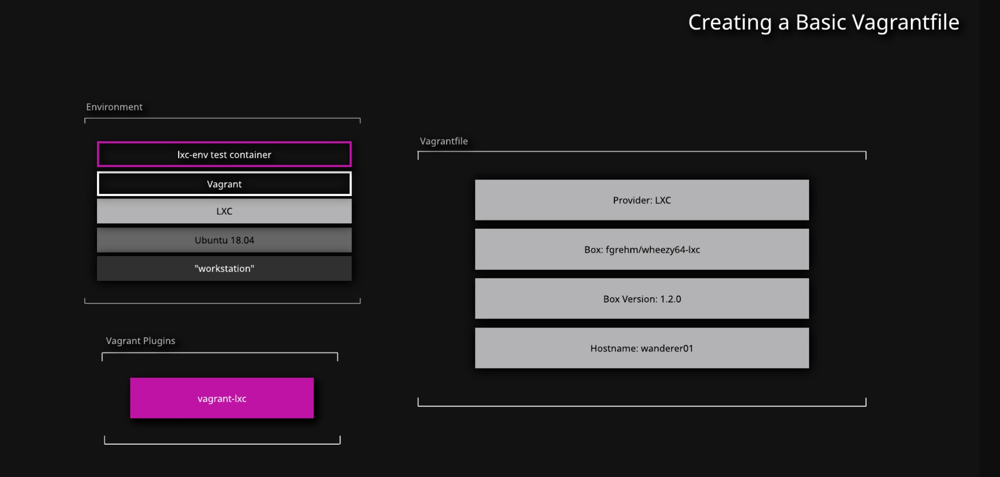

Begin by logging in to the lab server using the credentials provided on the hands-on lab page:

```bash
ssh cloud_user@PUBLIC_IP_ADDRESS
sudo apt install lxc
```
## Generate the Vagrantfile
1. Create the `wanderer-app` directory:
    ```bash
        mkdir wanderer-app
    ```
2. Move into that directory:
    ```bash
    cd wanderer-app/
    ```
3. Generate a `Vagrantfile`:
    ```bash
    vagrant init
    ```
## Write the Vagrantfile
1. Open the `Vagrantfile`:
    ```bash
    vim Vagrantfile
    ```
2. Update the `Vagrantfile` based on the instructions; you may wish to remove any unneeded contents generated in the `vagrant init`:
    ```bash
    # -*- mode: ruby -*-
    # vi: set ft=ruby :
    Vagrant.configure("2") do |config|
      config.vm.box = "fgrehm/wheezy64-lxc"
      config.vm.box_version = "1.2.0"
      config.vm.hostname = "wanderer"
      config.vm.provider "lxc"
    end
    ```
## Test the Vagrantfile
1. To test the `Vagrantfile`, run:
    ```bash
    vagrant up
    ```

2. Check whether the Vagrant box is running with:
    ```bash
    vagrant status
    ```