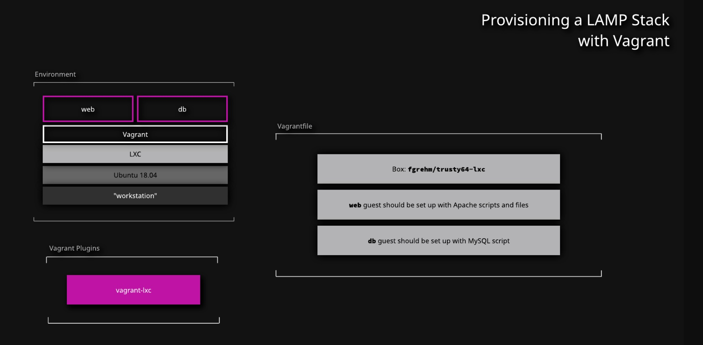

## Provisioning a LAMP Stack with Vagrant


## Create the Vagrantfile
1. Move into the `lamp` project directory and generate a new Vagrantfile:
    ```bash
    cd lamp/
    vagrant init
    ```
2. Open the Vagrantfile, and then update it to create _two_ different machine method blocks, one for each guest:
    ```bash
    Vagrant.configure("2") do |config|
    config.vm.box = "fgrehm/trusty64-lxc"
    config.vm.provider "lxc"

    config.vm.define "web" do |web|
    end

    config.vm.define "db" do |db|
    end
    end
    ```

## Set Up Provisioning

1. Use the shell and file provisioners to run the needed scripts and add the desired configuration:

    ```bash
    Vagrant.configure("2") do |config|
        config.vm.box = "fgrehm/trusty64-lxc"
        config.vm.provider "lxc"
        config.vm.define "web" do |web|
            web.vm.provision "shell", path: "scripts/apache-install.sh"
            web.vm.provision "file", source: "configs/apache-example.site",
            destination: "/tmp/configs/apache-example.site"
            web.vm.provision "shell", path: "scripts/apache-sites.sh"
        end
        config.vm.define "db" do |db|
            db.vm.provision "shell", path: "scripts/mysql-install.sh"
        end
    end
2. Save and exit the file.

### Test the Vagrantfile

1. Deploy the environment:
    ```bash
    vagrant up
    ```
2. Ensure Apache was installed on the `web` guest:
    ```bash
    vagrant ssh web sudo service apache2 status exit
    ```

3. Ensure MySQL was installed on the `db` guest:
    ```bash
    vagrant ssh db sudo service mysql status exit
    ```


## Conclusion

Congratulations — you've completed this hands-on lab!