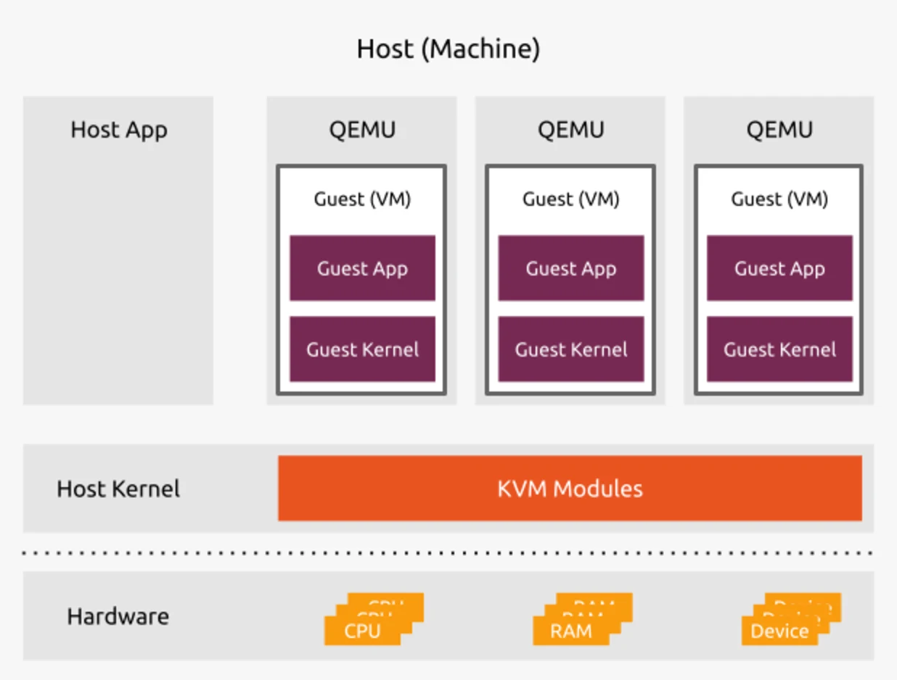

## KVM

1. Install KVM
```bash
sudo apt -y install bridge-utils cpu-checker libvirt-clients libvirt-daemon qemu qemu-kvm
```
2. Check virtualisation capabilities
```bash
kvm-ok
```
3. Verify Installation
```bash
virsh list --all
```

4. Install vert-manager
```bash
sudo apt install virt-manager
```
5. Start & Enable Virtualization Daemon
```bash
sudo systemctl enable --now libvirtd
sudo systemctl start libvirtd
sudo usermod -aG kvm $USER
sudo usermod -aG libvirt $USER
```
4. Launch a VM
```bash
sudo virt-install --name ubuntu-guest --os-variant ubuntu20.04 --vcpus 2 --ram 2048 --location http://ftp.ubuntu.com/ubuntu/dists/focal/main/installer-amd64/ --network bridge=virbr0,model=virtio --graphics none --extra-args='console=ttyS0,115200n8 serial'
```
